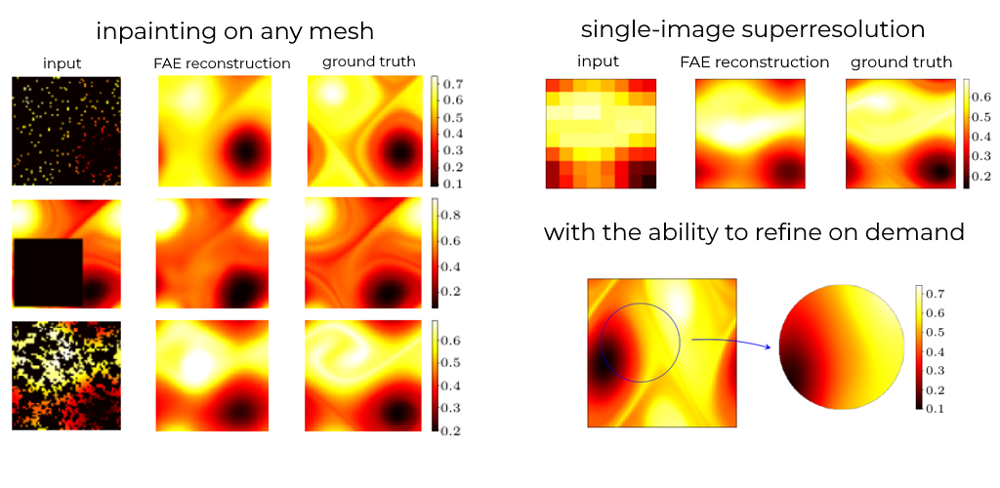

# `functional_autoencoders`: Autoencoders in Function Space

This is the official code repository accompanying the paper:

> **Autoencoders in Function Space** 
>
> Justin Bunker, Mark Girolami, Hefin Lambley, Andrew M. Stuart and T. J. Sullivan (2025).
> *Journal of Machine Learning Research* **26**(165):1–54.
>
> [Full text at JMLR](https://jmlr.org/papers/volume26/25-0035/25-0035.pdf) —  [arXiv:2408.01362](https://arxiv.org/abs/2408.01362).

The `functional_autoencoders` module contains implementations of 
1. **Functional Variational Autoencoder (FVAE)**, an extension of variational autoencoders (VAEs) to functional data; and
2. **Functional Autoencoder (FAE)**, a regularised nonprobabilistic autoencoder for functional data.

## Quickstart

**If you want to install the `functional_autoencoders` package** (e.g., to use in your own projects and notebooks): clone the repository and install the package using `pip` with

    git clone https://github.com/htlambley/functional_autoencoders
    cd functional_autoencoders
    pip install .

You can then import the `functional_autoencoders` package in your own scripts and notebooks.
To get started, why not follow one of our quickstart notebooks:
head to the [getting started notebook](./quickstart/0_Getting_Started.ipynb) (`quickstart/0_Geting_Started.ipynb`) for an introduction to `functional_autoencoders`, and a guide on when to use each model.
Alternatively, you can go straight to

- [an introduction to FVAE](./quickstart/1_FVAE.ipynb) (`quickstart/1_FVAE.ipynb`); or
- [an introduction to FAE](./quickstart/2_FAE.ipynb) (`quickstart/2_FAE.ipynb`)

depending on your interests, where you'll learn how to reproduce some of the results in [the paper](https://arxiv.org/abs/2408.01362).
You can also learn how to use FVAE and FAE with [your own data](./quickstart/3_Custom_Datasets.ipynb) (`quickstart/3_Custom_Datasets.ipynb`) and [custom encoder/decoder architectures](./quickstart/4_Custom_Architectures.ipynb) (`quickstart/4_Custom_Architectures.ipynb`).

## Reproducing results in the paper

If you want to reproduce the results from the paper without installing the `functional_autoencoders` package:
clone the repository, install the dependencies, and run the main experimental script with

    git clone https://github.com/htlambley/functional_autoencoders
    cd functional_autoencoders
    pip install -r requirements.txt
    python experiments/main_run.py

## Citation

You can cite the preprint with the following BibTeX/BibLaTeX entry:

    @article{BunkerGirolamiLambleyStuartSullivan2025,
        author = {Bunker, Justin and Girolami, Mark and Lambley, Hefin and Stuart, Andrew M. and Sullivan, T. J.},
        title = {Autoencoders in Function Space},
        journal = {Journal of Machine Learning Research},
        pages = {1--54}, 
        volume = {26},
        number = {165},
        year = {2025},
        url = {http://jmlr.org/papers/v26/25-0035.html},
    }

Questions, comments, and suggestions for the code repository are welcome through the issue tracker on GitHub or via email to
- [Justin Bunker](https://www.eng.cam.ac.uk/profiles/jb2200) (`jb2200@cantab.ac.uk`); and
- [Hefin Lambley](https://warwick.ac.uk/htlambley) (`hefin.lambley@warwick.ac.uk`).
